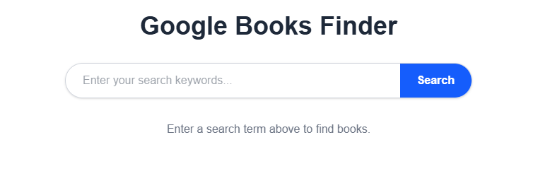
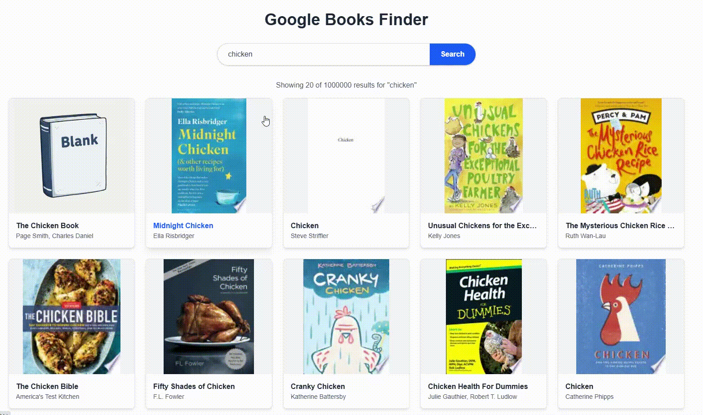
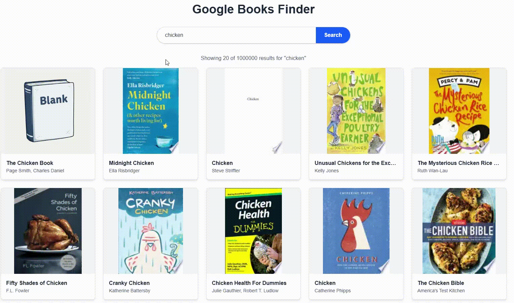
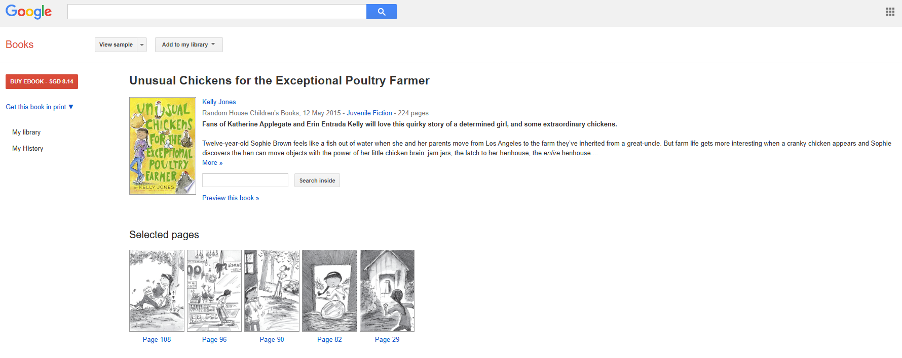
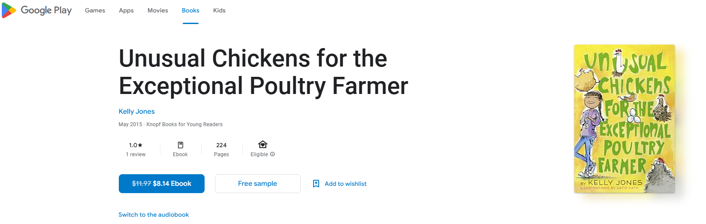

# Google Books Finder (Using Next.js App Router)

A simple web application to search for books using the Google Books API, built with Next.js App Router, TypeScript, and Tailwind CSS.

## Features

*   Search for books by keyword.
*   View a list of search results with book covers, titles, and authors.
*   Click on a book to view detailed information (description, publisher, etc.).

## Getting Started

Follow these instructions to get a copy of the project up and running on your local machine for development and testing purposes.

### Prerequisites

*   [Node.js](https://nodejs.org/) (LTS version recommended, e.g., 18.x or 20.x) - This includes npm.
*   A [Google Account](https://accounts.google.com/signup) to obtain API keys.

### Installation & Setup

1.  **Clone the repository:**
    ```bash
    git clone https://github.com/jerwkw/AISG-TA.git
    cd aisg-TA/google-books-finder
    ```

2.  **Install dependencies:**
    ```bash
    npm install
    # or if you prefer yarn:
    # yarn install
    ```

3.  **Set up Google Books API Key:**
    *   Go to the [Google Cloud Console](https://console.cloud.google.com/).
    *   Create a new project or select an existing one.
    *   Navigate to "APIs & Services" > "Library".
    *   Search for "Google Books API" and enable it.
    *   Navigate to "APIs & Services" > "Credentials".
    *   Click "+ CREATE CREDENTIALS" > "API key".
    *   Copy the generated API key.

4.  **Create Environment File:**
    *   In the root of the project (`google-books-finder`), create a file named `.env.local`.
    *   Add your API key to this file:
        ```.env.local
        # .env.local - Do not commit this file!
        GOOGLE_BOOKS_API_KEY=YOUR_API_KEY_HERE
        ```
    *   Replace `YOUR_API_KEY_HERE` with the actual key you obtained from Google Cloud.

5.  **Run the development server:**
    ```bash
    npm run dev
    # or
    # yarn dev
    ```

6.  **Open the application:**
    Open [http://localhost:3000](http://localhost:3000) (or the port indicated in your terminal) in your browser.

## Technologies Used

*   [Next.js](https://nextjs.org/) (App Router)
*   [React](https://reactjs.org/)
*   [TypeScript](https://www.typescriptlang.org/)
*   [Tailwind CSS](https://tailwindcss.com/)
*   [Google Books API](https://developers.google.com/books)

---

## Usage Guide

Upon visiting the url, you will be greeted with the Search Page:



Type in your search query and click Search to find related books



Click on a book to see more detailed information



You can then click on "Preview on Google Books" to view the Google Books page



Or click on "More Info" to view the Play Store page


